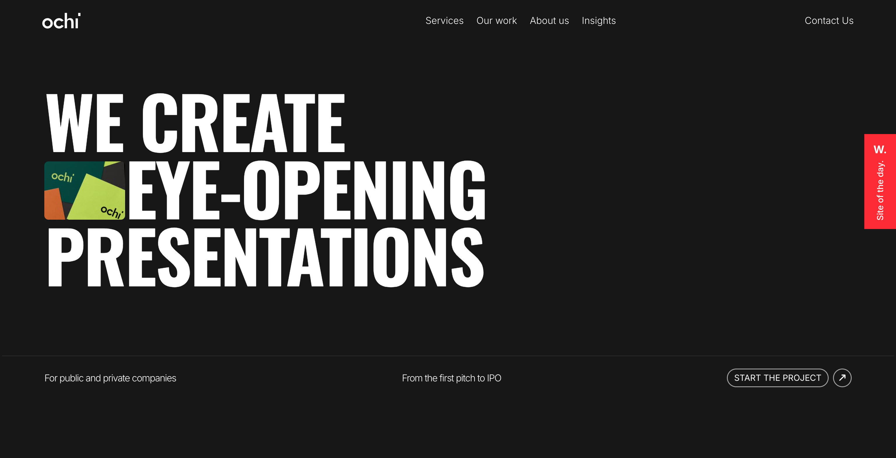

# Ochi.design clone using react.js

Original website: https://ochi.design/


## 🖥️ Demo
[]()


## 🛠️ Tech Stack
- **React** - Frontend framework
- **Tailwind CSS** - Styling
- **JavaScript** - Type Checking
- **Framer Motion** - For animation


## 📦 Installation


## Install Using NPM

### Clone the Repository
```sh
git clone https://github.com/SoumyadipDutta1004/Ochi-clone.git
cd todo-list-react-ts
```

### Install Dependencies
```sh
npm install
```

### Run the Application
```sh
npm run dev
```

Now, open your browser and navigate to `http://localhost:5173` to use the todo list.

---
Made with ❤️ by **Soumyadip Dutta**

